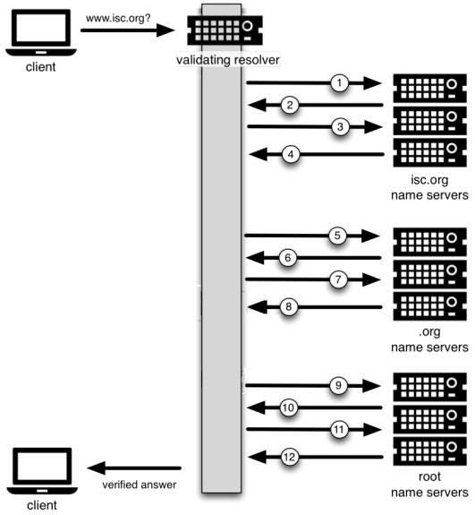

Title: DNSSEC
Date: 2019-09-23 14:16
Author: jinhaochan
Category: Security
Tags: DNSSEC
Slug: dnssec
Status: published

<!-- wp:paragraph -->

In the previous post, we talked about some of the attack vectors on the DNS. In this post, we're going to be talking about DNSSEC, which is an attempt to make the DNS more secure.

<!-- /wp:paragraph -->

<!-- wp:paragraph -->

A point to note, DNSSEC does not provide Confidentiality, but only Integrity. Integrity in this case is ensuring that the reply that you received from the DNS is truly the reply, and not altered by any MITM means. The lack of Confidentiality is due to the fact that it does not encrypt your DNS traffic data, and all your queries are still exposed in plain text. These are several technologies out there now that are branching out into encryption of DNS data, named DNS over HTTPS (DoH). But for DNSSEC, there is no encryption.

<!-- /wp:paragraph -->

<!-- wp:paragraph -->

This post assumes you have knowledge of recursive DNS resolving of hostnames.

<!-- /wp:paragraph -->

<!-- wp:paragraph -->

DNSSEC introduces several new resources that are used by the DNSSEC verification process.

<!-- /wp:paragraph -->

<!-- wp:list -->

-   RRSIG (Resource Record Signature)
-   DNSKEY (Public Key for Verification)
-   DS (Delegation Signer)
-   NSEC (Proof of Nonexistence - No encryption)
-   NSEC3 ( Proof of Nonexistence - Encryption)

<!-- /wp:list -->

<!-- wp:paragraph -->

We'll go through each one of them, and explain how they are being used in the verification process.

<!-- /wp:paragraph -->

<!-- wp:heading {"level":4} -->

#### RRSIG

<!-- /wp:heading -->

<!-- wp:paragraph -->

With DNSSEC, every reply comes with at least one RRSIG reply. RRSIG acts like a digital certification, to verify that this reply is indeed authentic.

<!-- /wp:paragraph -->

<!-- wp:heading {"level":4} -->

#### DNSKEY

<!-- /wp:heading -->

<!-- wp:paragraph -->

DNSSEC operates on asymmetric encryption, and DNSKEY is the public key. The RRSIG is encrypted with the private key, and verification of the response is done by decrypting it with DNSKEY.

<!-- /wp:paragraph -->

<!-- wp:heading {"level":4} -->

#### DS

<!-- /wp:heading -->

<!-- wp:paragraph -->

During the recursive DNS resolution process, the parent has to verify the authenticity of the child server. This is done by signing the hash of the child. The parent becomes the Delegation Signing (DS) of the child

<!-- /wp:paragraph -->

<!-- wp:heading {"level":4} -->

#### NSEC/NSEC3

<!-- /wp:heading -->

<!-- wp:paragraph -->

Without DNSSEC, non-existent domains are return with NXDOMAIN. With DNSSEC, non-existent domains are handled by NSEC and NSEC3 records to prove that they really don't exist. NSEC3 is the encrypted version of NSEC. We'll talk about this in a section later below.

<!-- /wp:paragraph -->

<!-- wp:heading {"level":3} -->

### Difference in DNS lookup with DNSSEC

<!-- /wp:heading -->

<!-- wp:separator -->

------------------------------------------------------------------------

  

Up front, you can see that there is an additional layer called the Validating Resolver, which handles the DNSSEC process.

<!-- /wp:paragraph -->

<!-- wp:paragraph -->

The recursive DNS resolution to obtain the IP address of isc.org still remains the same (asking `.`, `.org` and `isc.org`). We start the phase above when we finally get the address of the authoritative server for the address of `isc.org`

<!-- /wp:paragraph -->

<!-- wp:list {"ordered":true} -->

1.  Ask the authoritative server for the IP address of `isc.org`
2.  Reply the IP address of `isc.org`. Also, send the encrypted RRSIG
3.  Ask for the public DNSKEY of `isc.org` to verify the RRSIG obtained in step 2
4.  Reply with the DNSKEY to decrypt the RRSIG, and verify the reply from `isc.org`
    -   `.org` is the parent of `isc.org`, and thus is the DS of `isc.org`. As part of the DNSSEC process, `isc.org` has to the hash of it's DNSKEY to `.org`
    -   The hash of the child's DNSKEY is signed by the parent's DNSKEY
    -   i.e. the hash of `isc.org` DNSKEY is signed by `.org` DNSKEY
5.  Ask for the hash of `isc.org` DNSKEY, and ensure that the DNSKEY obtained in step 4 is correct
6.  Reply with the hash of `isc.org` DNSKEY, along with the RRSIG of `.org`
7.  Ask for the public DNSKEY of `.org` to verify the RRSIG obtained in step 6
8.  Reply with the DNSKEY to decrypt the RRSIG, and verify the reply from `.org`
9.  **Ask for the hash of `.org` DNSKEY, and ensure that the DNSKEY obtained in step 8 is correct**
10. **Reply with the hash of `.org` DNSKEY, along with the RRSIG of the root server**
11. **Ask for the public DNSKEY of the root server to verify the RRSIG obtained in step 10**
12. **Reply with the DNSKEY to decrypt the RRSIG, and verify the reply from the root server**

<!-- /wp:list -->

<!-- wp:paragraph -->

You can see the pattern of these 4 sets of communication repeating. I've bolded steps 9, 10, 11, 12, as they are the same steps being repeated for each recursive step of DNS resolution.

<!-- /wp:paragraph -->

<!-- wp:heading {"level":3} -->

### These Are Not The Records You're Looking For

<!-- /wp:heading -->

<!-- wp:paragraph -->

The typical response from a DNS server when a non-existent domain is requested is returning an `NXDOMAIN` response. However, a simple `NXDOMAIN` will not suffice, as an attacker can simply spoof this reply to deny services to customers.

<!-- /wp:paragraph -->

<!-- wp:paragraph -->

With DNSSEC implemented, instead of using an `NXDOMAIN` to indicate a non-existent record, we use NSEC as a proof of non-existence. NSEC stands for Next-Secure-Record, and a gist of how it works is by providing information above records before and after the requested domain.

<!-- /wp:paragraph -->

<!-- wp:paragraph -->

For NSEC to work, the records need to be sorted alphabetically so that by showing the previous and next record, we can determine if the request domain does not exist.

<!-- /wp:paragraph -->

<!-- wp:paragraph -->

An example of this in action: We have 3 employees working at a company: Alice, Edward and Susan (already sorted alphabetically). When some one calls and asks for an employee called Bob (which doesn't exist), NSEC will reply the previous and next records (alphabetically), Alice and Edward.

<!-- /wp:paragraph -->

<!-- wp:paragraph -->

We can see an obvious problem over here. Probe for many non-existent domains, and NSEC will return to you all of the records in the DNS, something which we don't want. This act is called zone-walking, or zone enumeration.

<!-- /wp:paragraph -->

<!-- wp:paragraph -->

The solution to zone walking is simply to encrypt the information being sent over, which is what is implemented in NSEC3. NSEC3 hashes the entries before sending the data over to the requesting machine

<!-- /wp:paragraph -->

<!-- wp:heading {"level":3} -->

### Credits

<!-- /wp:heading -->

<!-- wp:paragraph -->

This post was a summary of this guide by ISC: <https://downloads.isc.org/isc/dnssec-guide/dnssec-guide.pdf>

<!-- /wp:paragraph -->

<!-- wp:paragraph -->

The above documentation is a lot more comprehensive, and this post is meant to highlight content that is important.

<!-- /wp:paragraph -->
